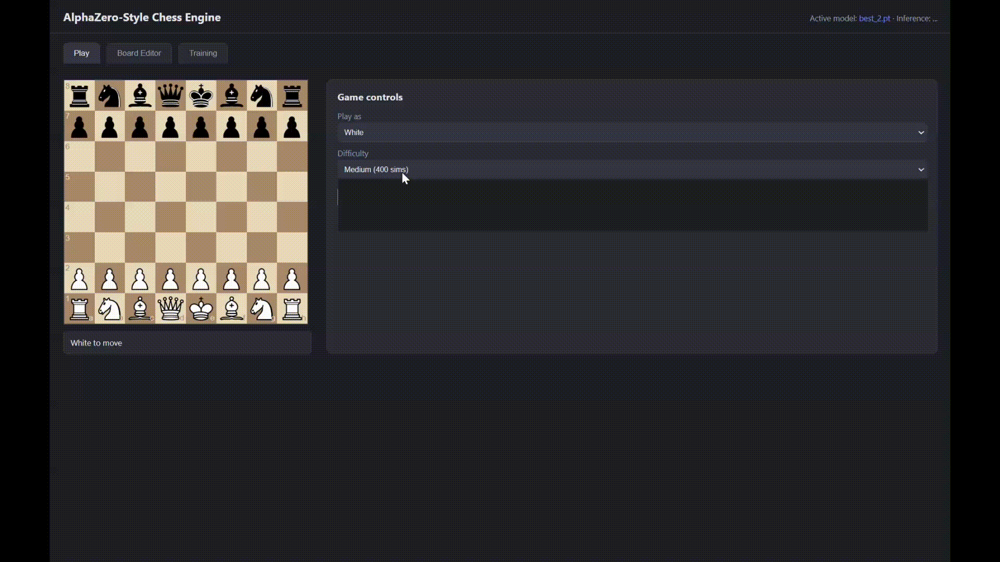

# AlphaZero-Style Chess Engine

A from-scratch chess engine that learns like AlphaZero / Lc0: a policy + value
ResNet guided by PUCT MCTS. It **bootstraps from Stockfish-labeled positions**
(supervised learning), then **refines via arena-gated self-play** with supervised
anchoring to avoid collapse.



**Deployed model:** `models/best_2.pt` (~1,680 Elo vs Stockfish skill 5 at 800 MCTS
sims with opening book + Syzygy tablebases). Trained on **4M depth-16** Stockfish
labels plus two self-play cycles (20×256 ResNet, ~32M params).

## Web app

Three modes:

- **Play** — play as White or Black; difficulty uses 200 / 400 / 800 MCTS sims.
- **Board Editor** — set up any position, get eval + top move suggestions.
- **Training** — launch and monitor labeling, supervised, and self-play jobs.

```bash
python -m cli serve
# open http://127.0.0.1:8000
```

The server loads `models/best_2.pt` by default and runs **ONNX int8** inference
when `models/best_2.int8.onnx` is present (export once with the command below).
Optional but recommended for full strength:

```bash
export OPENING_BOOK=books/opening.bin
export SYZYGY_PATH=books/syzygy
```

## Project layout

```
engine/     encoding, ResNet, MCTS, inference (PyTorch + ONNX), books, config
teacher/    Stockfish UCI wrapper (value + policy targets)
data/       position generation, labeling, dataset + replay buffer
train/      supervised bootstrap, arena-gated self-play, Elo evaluation
server/     FastAPI backend + static web frontend
cli.py      command-line entrypoint for the whole pipeline
```

## Setup

1. Create a virtual environment and install dependencies:

   ```bash
   pip install -r requirements.txt
   ```

2. Install [Stockfish](https://stockfishchess.org/download/) and point the
   project at it (needed for training and Elo evaluation, not for play-only):

   ```bash
   # macOS/Linux
   export STOCKFISH_PATH=/full/path/to/stockfish
   # Windows PowerShell
   $env:STOCKFISH_PATH = "C:\path\to\stockfish.exe"
   ```

3. **Model weights** are not bundled in this repo (129MB+ checkpoints). Place
   your trained checkpoint in `models/` or export ONNX for inference:

   ```bash
   python -m cli export-onnx --checkpoint models/best_2.pt --int8
   ```

   On Linux/GPU boxes, `scripts/setup_linux.sh` bootstraps PyTorch, paths, and
   ONNX export.

## Quick start (full pipeline)

```bash
export CHESSAI_DATA=data_d16          # labeled shard directory

# 1. Label positions (or use pre-built data_d16/)
python -m cli label --generate 500000 --depth 16 --workers 8

# 2. Supervised bootstrap (large net: --blocks 20 --channels 256)
python -m cli supervised --epochs 24 --blocks 20 --channels 256 --out supervised_big.pt

# 3. Self-play refinement (arena-gated; promotes to models/best.pt / best_2.pt)
python -m cli selfplay --init models/supervised_big.pt --sims 400 --workers 24 \
  --selfplay-device cpu --sup-fraction 0.5 --arena-every 3 --arena-games 300

# 4. Measure strength (use enough sims — strength scales with search)
python -m cli evaluate --checkpoint models/best_2.pt --games 50 --skill 5 \
  --sims 800 --use-books --workers 1

# 5. Health-check the value head
python -m cli probe --checkpoint models/best_2.pt --n 4096

# 6. Serve the web app
python -m cli serve
```

Steps 1–4 can also be started from the **Training** tab in the web UI.

## How training works

1. **Bootstrap (supervised).** Random and game-derived positions are labeled by
   Stockfish (value: `tanh(cp/350)`, policy: MultiPV softmax). The network learns
   to imitate the teacher.

2. **Self-play refinement.** The **champion** generates games with MCTS (Dirichlet
   root noise, temperature schedule, optional early resignation + Syzygy forced
   endings). A **candidate** is trained on a replay buffer mixed 50/50 with
   supervised data. Every N iterations an **arena** match (mirrored pairs, mixed
   book openings) gates promotion — the deployed net only improves.

3. **Evaluate.** `train/evaluate.py` estimates Elo vs skill-limited Stockfish.
   Numbers are approximate; use them for **relative** progress between checkpoints.
   Match deployment settings (`--sims`, `--use-books`) when comparing.

## Inference backends

Set `CHESSAI_INFER` to choose the runtime (auto-detects ONNX beside the checkpoint):

| Backend | When to use |
|---------|-------------|
| `onnx-int8` | Default for serve/eval on CPU (fast) |
| `onnx` | FP32 ONNX |
| `torch` | Training, self-play workers |

```bash
python -m cli export-onnx --checkpoint models/best_2.pt --int8
export CHESSAI_INFER=onnx-int8
export CHESSAI_ONNX=models/best_2.int8.onnx
```

## Scaling to a cloud GPU

Install a CUDA build of PyTorch (`scripts/setup_linux.sh` handles RTX 50-series
/sm_120). Train on GPU; run self-play workers on CPU (`--selfplay-device cpu`,
many `--workers`) to avoid CUDA multiprocessing issues.

Increase network size (`--blocks`, `--channels`), label depth, self-play
`--sims`, and `--games-per-iter` on larger boxes.

## Windows + AMD GPU (RX 9070 XT)

`scripts/setup_windows_amd.ps1` sets up ROCm PyTorch (exposed as `cuda`), Stockfish,
and lc0. Training runs on the GPU as usual.

**Labeling on the GPU with lc0.** Stockfish only runs on the CPU. As an alternative
teacher, [Leela Chess Zero](https://lczero.org) runs a network on the GPU (DirectML):

```powershell
. .\.env.ps1
python -m cli label --generate 170000 --teacher lc0 --nodes 200 --chain-len 6 `
  --workers 3 --min-ply 4 --max-ply 60
```

- Policy targets are lc0's root **visit distribution**; value targets are the root
  WDL expectation `P(win) - P(loss)`. These are not on the same scale as the
  Stockfish `tanh(cp/350)` targets, so don't mix the two in one data directory.
- `--chain-len K` labels K consecutive positions per start position by playing the
  teacher's sampled move after each one, giving realistic game positions (not just
  random-walk ones) at no extra search cost. `--generate N` is then the number of
  *start* positions, yielding up to `N * K` samples.
- Throughput is set by the GPU, not by worker count: 512x15 net ≈ 5.7k nodes/s,
  distilled 256x10 + fp16 ≈ 13k nodes/s on a 9070 XT (about 40-55 positions/s at
  100-200 nodes). More than ~3 workers doesn't help.
- The 256x10 net is the default (`lc0/net.pb.gz`); set `LC0_WEIGHTS` to use another.

## Notes

- Under-promotions are supported in the policy head; the web UI auto-queens for simplicity.
- Elo estimates depend on sim count, books, and sample size — report them together.
- Checkpoints can be tracked with Git LFS (see `.gitattributes`); the demo GIF is
  in-repo; full `.pt` weights are usually kept out of git.
