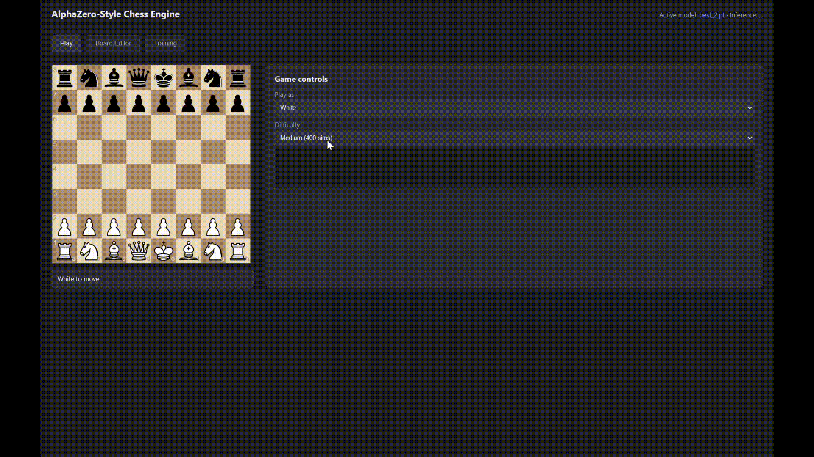

# AlphaZero-Style Chess Engine

A from-scratch chess engine that learns like AlphaZero / Lc0: a policy + value
ResNet guided by PUCT MCTS. It **bootstraps from Stockfish-labeled positions**
(supervised learning), then **refines via arena-gated self-play** with supervised
anchoring to avoid collapse.



**Deployed model:** `models/best_2.pt` (~1,680 Elo vs Stockfish skill 5 at 800 MCTS
sims with opening book + Syzygy tablebases). Trained on **4M depth-16** Stockfish
labels plus two self-play cycles (20×256 ResNet, ~32M params).

**Latest model:** `models/best_small.pt` (10×128 ResNet, win/draw/loss value head),
~1,630 Elo vs Stockfish skill 3 at 800 sims after 200 iterations of fully GPU-resident
self-play. See [Results](#results-best_small-10128).

## Web app

Three modes:

- **Play** — play as White or Black; difficulty uses 200 / 400 / 800 MCTS sims.
- **Board Editor** — set up any position, get eval + top move suggestions.
- **Training** — launch and monitor labeling, supervised, and self-play jobs.

```bash
python -m cli serve
# open http://127.0.0.1:8000
```

The server loads `models/best_2.pt` by default and runs **ONNX int8** inference
when `models/best_2.int8.onnx` is present (export once with the command below).
Optional but recommended for full strength:

```bash
export OPENING_BOOK=books/opening.bin
export SYZYGY_PATH=books/syzygy
```

## Project layout

```
engine/     encoding, ResNet, MCTS, inference (PyTorch + ONNX), books, config;
            gpuchess / gpumcts / gpuplay: batched move generation, MCTS, self-play and arena on the GPU
teacher/    Stockfish UCI wrapper (value + policy targets)
data/       position generation, labeling, dataset + replay buffer
train/      supervised bootstrap, arena-gated self-play (CPU workers or gpu_loop), Elo evaluation
scripts/    launchers (run_selfplay.ps1, run_distill_label.ps1), setup, tests
server/     FastAPI backend + static web frontend
cli.py      command-line entrypoint for the whole pipeline
```

## Setup

1. Create a virtual environment and install dependencies:

   ```bash
   pip install -r requirements.txt
   ```

2. Install [Stockfish](https://stockfishchess.org/download/) and point the
   project at it (needed for training and Elo evaluation, not for play-only):

   ```bash
   # macOS/Linux
   export STOCKFISH_PATH=/full/path/to/stockfish
   # Windows PowerShell
   $env:STOCKFISH_PATH = "C:\path\to\stockfish.exe"
   ```

3. **Model weights** are not bundled in this repo (129MB+ checkpoints). Place
   your trained checkpoint in `models/` or export ONNX for inference:

   ```bash
   python -m cli export-onnx --checkpoint models/best_2.pt --int8
   ```

   On Linux/GPU boxes, `scripts/setup_linux.sh` bootstraps PyTorch, paths, and
   ONNX export.

## Quick start (full pipeline)

```bash
export CHESSAI_DATA=data_d16          # labeled shard directory

# 1. Label positions (or use pre-built data_d16/)
python -m cli label --generate 500000 --depth 16 --workers 8

# 2. Supervised bootstrap (large net: --blocks 20 --channels 256)
python -m cli supervised --epochs 24 --blocks 20 --channels 256 --out supervised_big.pt

# 3. Self-play refinement (arena-gated; promotes to models/best.pt / best_2.pt)
python -m cli selfplay --init models/supervised_big.pt --sims 400 --workers 24 \
  --selfplay-device cpu --sup-fraction 0.5 --arena-every 3 --arena-games 300

# 4. Measure strength (use enough sims — strength scales with search)
python -m cli evaluate --checkpoint models/best_2.pt --games 50 --skill 5 \
  --sims 800 --use-books --workers 1

# 5. Health-check the value head
python -m cli probe --checkpoint models/best_2.pt --n 4096

# 6. Serve the web app
python -m cli serve
```

Steps 1–4 can also be started from the **Training** tab in the web UI.

## How training works

1. **Bootstrap (supervised).** Random and game-derived positions are labeled by
   Stockfish (value: `tanh(cp/350)`, policy: MultiPV softmax). The network learns
   to imitate the teacher.

2. **Self-play refinement.** The **champion** generates games with MCTS (Dirichlet
   root noise, temperature schedule, optional early resignation + Syzygy forced
   endings). A **candidate** is trained on a replay buffer mixed 50/50 with
   supervised data. Every N iterations an **arena** match (mirrored pairs, mixed
   book openings) gates promotion — the deployed net only improves.

3. **Evaluate.** `train/evaluate.py` estimates Elo vs skill-limited Stockfish.
   Numbers are approximate; use them for **relative** progress between checkpoints.
   Match deployment settings (`--sims`, `--use-books`) when comparing.

## Inference backends

Set `CHESSAI_INFER` to choose the runtime (auto-detects ONNX beside the checkpoint):

| Backend | When to use |
|---------|-------------|
| `onnx-int8` | Default for serve/eval on CPU (fast) |
| `onnx` | FP32 ONNX |
| `torch` | Training, self-play workers |

```bash
python -m cli export-onnx --checkpoint models/best_2.pt --int8
export CHESSAI_INFER=onnx-int8
export CHESSAI_ONNX=models/best_2.int8.onnx
```

## Scaling to a cloud GPU

Install a CUDA build of PyTorch (`scripts/setup_linux.sh` handles RTX 50-series
/sm_120). Train on GPU; run self-play workers on CPU (`--selfplay-device cpu`,
many `--workers`) to avoid CUDA multiprocessing issues.

Increase network size (`--blocks`, `--channels`), label depth, self-play
`--sims`, and `--games-per-iter` on larger boxes.

## Windows + AMD GPU (RX 9070 XT)

`scripts/setup_windows_amd.ps1` sets up ROCm PyTorch (exposed as `cuda`), Stockfish,
and lc0. Training runs on the GPU as usual.

**Labeling on the GPU with lc0.** Stockfish only runs on the CPU. As an alternative
teacher, [Leela Chess Zero](https://lczero.org) runs a network on the GPU (DirectML):

```powershell
. .\.env.ps1
python -m cli label --generate 170000 --teacher lc0 --nodes 200 --chain-len 6 `
  --workers 3 --min-ply 4 --max-ply 60
```

- Policy targets are lc0's root **visit distribution**; value targets are the root
  WDL expectation `P(win) - P(loss)`. These are not on the same scale as the
  Stockfish `tanh(cp/350)` targets, so don't mix the two in one data directory.
- `--chain-len K` labels K consecutive positions per start position by playing the
  teacher's sampled move after each one, giving realistic game positions (not just
  random-walk ones) at no extra search cost. `--generate N` is then the number of
  *start* positions, yielding up to `N * K` samples.
- Throughput is set by the GPU, not by worker count: 512x15 net ≈ 5.7k nodes/s,
  distilled 256x10 + fp16 ≈ 13k nodes/s on a 9070 XT (about 40-55 positions/s at
  100-200 nodes). More than ~3 workers doesn't help.
- The 256x10 net is the default (`lc0/net.pb.gz`); set `LC0_WEIGHTS` to use another.
- lc0 reuses its search tree along a chain, so chained positions label faster: at
  400 nodes, ~35 positions/s with `--chain-len 3` vs ~23/s for independent positions.

## GPU self-play (`--engine gpu`)

Self-play, search and arena gating can run entirely on the GPU: `engine/gpuchess.py`
generates legal moves for hundreds of boards at once, `engine/gpumcts.py` runs batched
PUCT search (recorded once as a HIP/CUDA graph and replayed each simulation), and
`train/gpu_loop.py` drives the champion/candidate loop with no worker processes.

```powershell
powershell -File scripts\run_selfplay.ps1 -Iterations 200 [-LrDecayFrom 200 -LrDecayIters 40]
```

The launcher restarts on crash or hang and resumes at the next unfinished iteration
from the champion checkpoint (`models/best_small.pt`); every promoted champion is also
kept as `models/best_small_it<N>.pt`. Progress goes to `logs/selfplay.jsonl`.

- **Value head:** win/draw/loss logits (cross-entropy loss); the scalar value used by
  search is `P(win) - P(loss)`. Older single-scalar checkpoints load with a freshly
  initialized value head.
- **Gating:** the launcher's default `-GateThreshold 0.43` promotes a candidate unless
  it is significantly worse than about −50 Elo, as in early Lc0 gating. Use 0.5 to
  require a proven improvement.
- **ROCm on Windows:** set `TORCH_BLAS_PREFER_HIPBLASLT=0` in the environment *before*
  Python starts (the launchers do this); hipBLASLt cannot run under graph capture.
- `cli evaluate` still searches with the Python MCTS in worker processes, so it is
  CPU-bound even when the network runs on the GPU. For checkpoint-vs-checkpoint
  matches use `engine.gpuplay.gpu_arena`.

## Distillation from lc0

Self-play alone gains slowly at this network size, so the engine is also trained on
lc0's analysis of positions from its *own* games:

```powershell
powershell -File scripts
un_distill_label.ps1   # -Checkpoint modelsest_small_it197.pt
powershell -File scripts
un_distill_train.ps1   # -Init modelsest_small_it197.pt
python scripts/arena.py models/distill_small.pt models/best_small_it197.pt --pairs 150 --sims 400
```

1. `scripts/selfplay_fens.py` plays GPU self-play (128 sims) and writes unique
   positions to `data_distill/fens.txt` (1.3M positions, ~5 h on a 9070 XT).
2. `cli label --teacher lc0 --nodes 400 --chain-len 3` labels each position plus
   lc0's next two moves, stopping at 3.5M samples (~28 h). Both steps resume after a
   restart.
3. `cli supervised --resume <checkpoint>` fine-tunes the self-play net on those labels
   (8 epochs, lr 5e-4 cosine, ~25 min); the WDL head is trained with the same
   cross-entropy loss as in self-play.
4. `scripts/arena.py` plays the result against the starting checkpoint on the GPU.

Round 1 (from iteration 197): `distill_small.pt` beat it197 +93 =146 −61 (300 games,
400 sims), **+37 Elo** (95% CI +9 to +66). Per GPU-hour (~33 h in all) that is about the
same rate as recent self-play, so self-play then resumed from the distilled net with
`data_distill` as its supervised anchor:

```powershell
powershell -File scripts
un_selfplay.ps1 -Iterations 300 -DataDir data_distill -GateThreshold 0.5 -NoGateSignificance
```

## Results (`best_small`, 10×128)

Estimated Elo vs Stockfish skill 3 (50 ms/move, taken as 1575), 150 games per point,
torch inference:

| Iteration | 80 | 101 | 110 | 131 | 140 | 161 | 197 |
|---|---|---|---|---|---|---|---|
| 80 sims | 1274 | 1287 | 1234 | 1345 | 1264 | 1312 | 1341 |
| 800 sims | 1582 | 1608 | 1596 | 1619 | 1617 | 1665 | 1629 |

- Search depth dominates: 800 sims is worth ~+300 Elo over 80 sims.
- Each point is ±50–60 Elo. Direct matches (300 games, 400 sims) are tighter:
  iteration 101 beat 80 by +64, 131 beat 80 by +99, and 197 beat 131 by +47.
- Self-play gains ~0.5 Elo per iteration at this stage.

## Notes

- Under-promotions are supported in the policy head; the web UI auto-queens for simplicity.
- Elo estimates depend on sim count, books, and sample size — report them together.
- Checkpoints can be tracked with Git LFS (see `.gitattributes`); the demo GIF is
  in-repo; full `.pt` weights are usually kept out of git.
